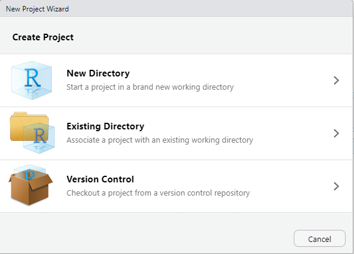

# Geospatial Data

## Requirements

To use `ggmap`, we first must install it in our project:

```r
install.packages("ggmap")
```

Maps created with `ggmap` will show a background image of a map and assign the x- and y-axis  longitude and latitude of the map section. To obtain map images, we can choose from the two supported providers, [Google Maps](https://www.google.com/maps) or [Stamen Maps](http://maps.stamen.com/).  Stamen Maps do not require authentication with an API token (as Google Maps does), so in this introduction, we'll go with that.&#x20;

To get a background image for our map, we need to specify the bounding box in terms of longitude and latitude coordinates. To obtain the background image with minimal overhead and directly from our R-program, we install the `osmdata` package. This package accesses the [OpenStreetMap](https://www.openstreetmap.org/) service to get the bounding boxes:

```r
install-packages("osmdata")
```

## Creating a map visualization

To create a map, we go through the following steps:

1. [Retrieve the bounding box](geodaten.md#retrieve-the-bounding-box) for our desired background map image using `osmdata::getbb`. We can simply pass a query such as "Osnabrück" to the function. Any query that works on their [web interface](https://www.openstreetmap.org/) should also work with the function `getbb`.
2. [Get the background image](geodaten.md#get-the-background-image-from-stamen-maps) for our map with the `ggmap::get_map` function, passing the bounding box from step 1.
3. [Create the empty map](geodaten.md#create-the-empty-map) with `ggmap`.
4. [Add data layers](geodaten.md#add-the-data-layer), such as points or polygons, on top of the map.

### 1. Retrieve the bounding box

Let's assume we want to visualize our Campusbier orders on a map of Osnabrück. The data set contains the longitude and latitude information about the customer's billing address. Following the steps above, we first get the bounding box (longitude and latitude coordinates for the map's boundaries) for Osnabrück:

```r
library(osmdata)
city <- "Osnabrück"
bb_os <- getbb(city)
```

### 2. Get the background image from Stamen Maps

We can now get the image by passing the bounding box to the `get_map` function:

```
os_map <- get_map(location = bb_os,
                 source = "stamen",
                 maptype = "terrain",
                 crop = TRUE,
                 color = "bw")
```

Note that the get\_map function has several arguments that we can use to specify the type of map we want. Stamen Maps support the different map types "terrain", "toner", and "watercolor", which all product a different look. Play around with it to see what works best for you. With `color = "bw"`, we can produce a grayscale version of the map.

### 3. Create the empty map

We can display the map now using the `ggmap` function:

```
ggmap(os_map)
```

<figure><figcaption></figcaption></figure>

### 3. Add the data layer

The final step is adding the data layer on top of the map:

```
ggmap(os_map)
  labs(x= NULL, y = NULL) +
  geom_point(data = orders_week, 
             aes(
               x = billing_address_longitude, 
               y = billing_address_latitude,
               size = total_price),
             color = "#009ee3",
             alpha = 0.7
            )
```

In this case, we draw points on the map for each order. The size of a point corresponds to the turnover (`total_price`) for each order. Order with more turnover appear larger:&#x20;

<figure><figcaption><p>A map of Osnabrück with orders shown as circles.</p></figcaption></figure>

In the example above, we used points to map coordinates in our data to the map. Additionally, we display some relevant information, in this case the turnover, using a visual property like the size of each point. This type of map visualization is very common and useful when we want to show exact coordinates.&#x20;

Occasionally, we wish to show more aggregated data on the level of areas, such as countries, states or zip code areas. We can draw these areas as shapes onto the map, and fill the area with a color to visualize certain properties (such as population density). This is called a choropleth map.

## Choropleth maps

As an alternative to location-based maps, in which we draw points in certain positions (coordinates) of the map, we can draw shapes that correspond to an _area_ of the map. Zip codes are an example, as every zip code area can be described by a polygon, which is a set of connected coordinates. To work with an example, we can download the zip code polygons for Germany along with other information about the zip code areas from the following link:



We can choose the format to download. A common format for GIS data (GIS = Graphical Information System) is the Shapefile format. This is a standardized format that most GIS systems support. There is also a package in R that supports this format, called `sf`.

<figure><figcaption><p>You can download the zip code data in the popular Shapefile format. Other formats are available as well.</p></figcaption></figure>

### Loading Shapefiles

#### The `sf`-package

The abbreviation "sf" is short for "Simple Feature", which is a "_set of standards that specify a common storage and access model of geographic feature made of mostly two-dimensional geometries_" ([Wikipedia](https://en.wikipedia.org/wiki/Simple\_Features)). The `sf`-library makes working with these standards simple in R.

There are numerous resources to get started with the sf-package. The package offers features for reading spatial data from data sources, such as files or database. But it can also create or manipulate whole new spatial structures. Have a look at the following to get an overview and to learn more:

* [Online-book Using Spatial Data with R by Claudia Engel (2019)](https://cengel.github.io/R-spatial/)
* [Online-book Spatial Data Science by Edzer Pebesma and Roger Bivand (2022)](https://r-spatial.org/book/)
* [Cheat sheet: Spatial manipulation with sf](https://github.com/rstudio/cheatsheets/blob/main/sf.pdf)

#### The `st_read` function

In this example, I have downloaded and unpacked the Shapefile with the German zip code data in my project folder under `data/plz_germany`. Then, I can load the Shapefile as follows, using the [`sf`-library](https://r-spatial.github.io/sf/)'s function `st_read`:

```r
library(sf)
zip <- st_read(here("data/plz_germany/"), as_tibble = T)

# Reading layer `georef-germany-postleitzahl' from data source 
#   `C:\rcode\apal_ws_22_23\data\plz_germany' using driver `ESRI Shapefile'
# Simple feature collection with 8934 features and 8 fields
# Geometry type: POLYGON
# Dimension:     XY
# Bounding box:  xmin: 5.866315 ymin: 47.27011 xmax: 15.04193 ymax: 55.05868
# Geodetic CRS:  WGS 84
```

The `st_read`-function can be configured to return the data as a tibble, which is what we want since we are working with the Tidyverse. When we look at the type of the `zip` object, we can see that it has the classes `data.frame`, `tbl` and `tbl_df`, as we would expect for a tibble. In addition, it also has the `sf` class:

```r
zip %>%  class()

# [1] "sf"         "tbl_df"     "tbl"        "data.frame"
```

#### Explore the Shapefile

Since the zip object is a tibble, we can use the well-known functions to explore the data a bit. For example, we can get the list of column names:

```r
zip |> colnames()

# [1] "name"        "plz_name"    "plz_name_lo" "plz_code"    "krs_code"   
# [6] "lan_name"    "lan_code"    "krs_name"    "geometry"   
```

Or filter the data based on one of the columns:

```r
zip |> filter(name == "49090") 

# Simple feature collection with 1 feature and 8 fields
# Geometry type: POLYGON
# Dimension:     XY
# Bounding box:  xmin: 7.965821 ymin: 52.28314 xmax: 8.099968 ymax: 52.33743
# Geodetic CRS:  WGS 84
# # A tibble: 1 x 9
#   name  plz_name  plz_name_lo     plz_code krs_code lan_n~1 lan_c~2 krs_n~3
# * <chr> <chr>     <chr>           <chr>    <chr>    <chr>   <chr>   <chr>  
# 1 49090 Osnabrück 49090 Osnabrück 49090    03404    Nieder~ 03      Kreisf~
# # ... with 1 more variable: geometry <POLYGON [°]>, and abbreviated
# #   variable names 1: lan_name, 2: lan_code, 3: krs_name
# # i Use `colnames()` to see all variable names
```

Because `sf` brings its version of the R `plot` function, we can directly pass the `zip` object to see the geometries. To plot the geometry information, we apply the `st_geometry`-function:

```r
plot(st_geometry(zip))
```

<figure><figcaption><p>A plot of all zip code areas in Germany.</p></figcaption></figure>

For our example of the Campusbier orders, we only want to plot the zip codes of Osnabrück. Tibble-style, we filter the data on the zip codes that start with "490":

```r
zip_os <- zip |>  
  filter(str_starts(name, "490"))
```

As a result, we get 9 entries, which correspond to the zip codes in and around the city of Osnabrück.

### Adding the zip code polygons to the map

We can now re-use the map of Osnabrück we created [above](geodaten.md#3.-create-the-empty-map) and add the layer with the zip code polygons. The `sf`-package extends `ggplot2` and comes with its own geometry `geom_sf`:

```
ggmap(os_map) +
  geom_sf(data = zip_os, alpha = 0.8, inherit.aes = F)
```

Note that we pass the filtered data in `zip_os` to the `geom_sf` function and tell it **not to use** the `aes`-mapping from `ggmap`. This important because in our `zip_os` object, there are no `lon` and `lat` fields. Instead, the `geom_sf`-function creates its own `aes`-mapping to draw the polygons.

<figure><figcaption><p>Osnabrück's zip code areas drawn on a map.</p></figcaption></figure>

The `alpha = 0.8` makes sure we can still see the streets under the zip code shapes.

### Filling the zip code polygons

We can now use the filling of the polygons to convey information in the visualization. We could choose a different color for each zip code:

```r
ggmap(os_map) +
  geom_sf(data = zip_os, 
          aes(fill = name),
          alpha = 0.8, inherit.aes = F)
```

<figure><figcaption><p>Osnabrück and its zip code area shown in different colors.</p></figcaption></figure>

This does not convey any information about our customers and orders. Instead, we can leverage the data we have and fill the area for each zip code according to the turnover we made there. How can we do that? We need to join the geometry data with the sales data.

#### Calculate the turnover by zip code

In the first step, we need a summary of our orders that contains the turnover per zip code:

```r
turnover_per_zip <- orders %>% 
  mutate(zip = as.character(billing_address_zip)) %>% 
  select(zip, total_price) %>% 
  group_by(zip) %>% 
  summarise(turnover = sum(total_price))

# # A tibble: 15 x 2
#    zip   turnover
#    <chr>    <dbl>
#  1 49009     36.9
#  2 49032    130. 
#  3 49074   5117. 
#  4 49075    138. 
#  5 49076  23739. 
#  ...
```

#### Join the turnover with geometry data

To join the geometry data with the turnover summary from above, we make sure the column with the zip code is named `zip` in both data frames. We can then use the `left_join` with the `by` attribute to merge the columns together:

```r
zip_os_with_turnover <- zip_os %>%
  rename(zip = name) %>% 
  left_join(turnover_per_zip, by = "zip")
```

We replace the object `zip_os` with the new version with the turnover value included and use the `turnover` column for the `fill` aesthetic:

```
ggmap(os_map) +
  geom_sf(data = zip_os_with_turnover, 
          alpha = 0.8, 
          mapping = aes(fill = turnover), 
          inherit.aes = F) +
  scale_fill_distiller(type = "seq", palette = "Blues", direction = 1)
```

Note that we also changed the color scale with `scale_fill_distiller` to a sequential palette from blue to white, where blue is more turnover and white is less.

<figure><figcaption><p>Osnabrück's zip codes filled according to the total turnover.</p></figcaption></figure>
