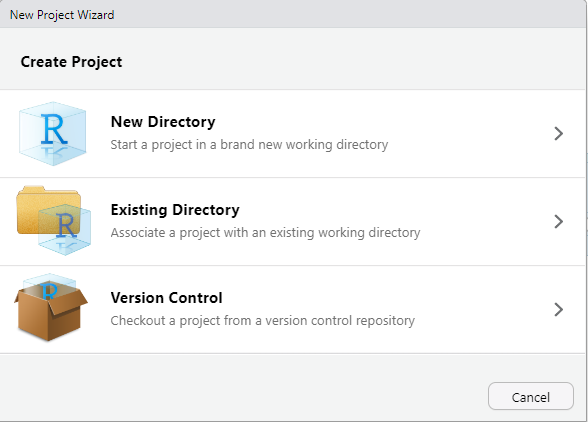

# 2 Projects

RStudio projects are organizational tools that help you manage your analyses, including all related data and scripts. You can create a new project in several ways.

## Cloning a GitHub repository

Starting from scratch isn't always the best approach. Sometimes, it's better to build upon someone else's code. If that code is available on GitHub or another platform hosting Git repositories, you can easily create a copy of that project on your local computer. All you need is a small tool called **git**. With git, you can clone projects containing code examples for all my data analytics courses. You'll find the git URLs below.

To use Git, you have two options: a client with a graphical user interface, like [GitHub Desktop](https://github.com/apps/desktop), or running Git from the command line, which I prefer. Either way, you'll need to install the latest version of Git on your computer. You can find all the downloads [here](https://git-scm.com/downloads).

To run git from a command line, you can use your operating system's integrated terminal. On Windows, it's called the _Command Line_ (`cmd.exe`), while on macOS and Linux, it's simply called the _Terminal_. RStudio also offers a built-in terminal—you'll find a "Terminal" tab right next to the console. When you click on this tab, you'll see your username and device name, followed by the current path the terminal is in:

<figure><figcaption>
A terminal integrated in RStudio Desktop.
</figcaption></figure>

Navigate to the directory where you want to store the example code for this course. If you're unfamiliar with terminal navigation, learn about the `cd` command, which stands for _change directory_. Choose a short path without spaces or special characters, including German umlauts (ä, ö, ü). For instance, I store all my R code in `c:\rcode`, creating subdirectories for each semester and project.

Once you're in your chosen directory, copy and paste the following command, then press ENTER. This will download a copy of the course's R project to your computer. To clone the repository with example code for my modules, you can use the following command :

<pre><code><strong>git clone https://github.com/winf-hsos/data-analytics-code.git
</strong></code></pre>

After the command completed, you should have a new subdirectory with the name of the project (`r:\code\data-analytics-code`) within the directory where you ran the command.

## Create a new project from scratch

To create a new empty project, click on File → New Project. A project wizard will open, offering you three options:

1. Create a project in a new directory
2. Create a project in an existing directory
3. Check out a project from a version control system

The third option is what we described earlier for GitHub, but other version control systems like SVN are also supported.

Choose option one or two, depending on whether you already have a folder containing files that should belong to your project.

<figure><figcaption>
There are 3 options to create a new project in RStudio.
</figcaption></figure>

If you create a new project from scratch (option 1), you'll be prompted to pick a project template. RStudio offers various templates that generate specific files and folders typically required for different project types. For a blank slate, simply select the "New Project" option.

<figure><figcaption></figcaption></figure>

In the next step, you'll need to enter a directory name and select a parent directory where this new directory will be created as a subdirectory. Select a location that's easy to remember and avoid using special characters, including German umlauts (ä, ö, ü). You'll also see an option to "Use renv with this project." I recommend checking this box if you plan to work on multiple projects on your computer. This creates a separate R environment within your project, allowing you to install packages specific to that project rather than in your global R installation. This approach is particularly useful if you need different versions of the same library for different projects.

Click "Create Project," and RStudio will open your new project.

